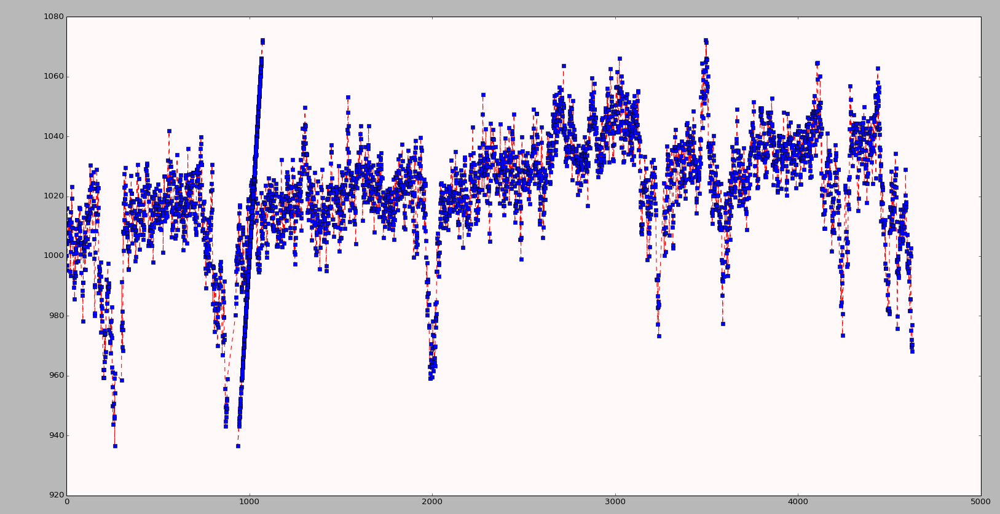

Locomotion Features
===================

Credit for all Locomotion feature definitions: [Yemini *et al.*
(2013)](http://www.nature.com/nmeth/journal/v10/n9/extref/nmeth.2560-S1.pdf)

There are four locomotion features: bends, motion, turns, and velocity.
Here they are in the actual HDF5 file storing them:

1. Velocity
-----------

The worm’s velocity is measured at five places:

-   the tip of the head ("headTip")
-   the tip of the tail ("tailTip")
-   the head
-   the tail
-   the midbody

*(The locations of the body parts used for feature computation: head,
neck, midbody, hips, and tail. Each body part encompasses 1/6 of the
worm (measured along the contour and skeleton, independently), save for
the midbody which is 1/3. The head and tail are further split in half to
create the head and tail tips, each 1/12 long.)*

**Which frames to use in velocity calculation**

At each frame of the video, we attempt to calculate an approximate
*instantaneous* velocity, by by using a starting and ending frame some
number of frames away from the frame in question:

-   The head tip and tail tips’ instantaneous velocity is measured at
    each frame using a 1/4 second up to a 1/2 second window. For each
    frame, we search for a start frame 1/4 of a second before and an end
    frame 1/4 second after to delineate the worm’s instantaneous path.
    If the worm’s location is not known within either the start or end
    frame, we extend the search for a known location up to 1/2 second in
    either direction. If the worm’s location is still missing at either
    the start or end, the velocity is marked unknown at this point.
-   The head, midbody, and tail velocity are computed identically except
    they use a 1/2 second up to a 1 second window for choosing their
    start and end frames.

**The velocity calculation for each body part**

The figure above on the left is a simple diagram representing worm
velocity and the crawling wave.

The figure above on the right shows how the velocity vector of a body
part is measured relative to the head-tail axis. In other words, the
velocity, per body part, is the vector of its respective
[centroid](http://en.wikipedia.org/wiki/Centroid). Therefore, to fully
characterize this vector, the velocity is composed of two parts:

1.  The **speed** is defined as the distance between the centroids of
    the start and end frames (for the respective body parts) divided by
    the time between both frames.
2.  The **direction**, expressed as an [angular
    speed](http://en.wikipedia.org/wiki/Angular_speed). Direction is
    defined as the angle (between centroids) from the start to the end
    frame, relative to the worm’s *overall body angle*, divided by the
    time between both frames.

The worm’s **overall body angle** is defined as the mean orientation of
the angles, in the tail-to-head direction, between subsequent midbody
skeleton points. The body angle is used to sign the velocity.

If the head or tail tip’s start-to-end angle exceeds 90°, clockwise or
anti-clockwise, relative to the overall worm body angle, the motion is
towards the tail. In this case both the speed and direction are
negatively signed. That is, the velocity is signed negatively whenever
the respective body part moves towards the tail (as opposed to the
head).

2. Motion States
----------------

The worm’s forward, backward, and paused motion states attempt to
differentiate these event states unambiguously:

.

*A 25 second window of worm motion reveals 2 forward, 3 backward, and
roughly 5 paused events. A short, small peak (between the second and
third pauses) that may have been forward motion, remains unclassified
due to ambiguity.*

Therefore, ambiguous motion has no associated state.

The motion states are computed from the worm’s **velocity** (described
above) and **length** (described in the section on
“[Morphology](morphology.md)”). Missing lengths are linearly
interpolated between segmented frames.

*Example of interpolated skeleton lengths:*

*Code to generate the above plot:*

    def get_motion_codes(midbody_speed, skeleton_lengths):
        ...  
        #  Interpolate the missing lengths.
        skeleton_lengths_interpolated = \
            interpolate_with_threshold(skeleton_lengths, 
                config.LONGEST_NAN_RUN_TO_INTERPOLATE)

        plt.plot(list(enumerate(skeleton_lengths_interpolated)), 
                 skeleton_lengths_interpolated, 'r--',
                 list(enumerate(skeleton_lengths)), skeleton_lengths, 'bs',)
        plt.show()
        ...

(The following filtering criteria were chosen based on human labeling of
events within a variety of N2 and mutant videos:)

-   The worm is defined in a state of **forward motion** when a period,
    more than half a second long, is observed wherein:
    -   a)  the worm travels at least 5% of its mean length over the
            entire period; and,
    -   b)  the worm’s speed is at least 5% of its length, per second,
            in each frame. The worm must maintain this speed almost
            continuously with permissible interruptions of, at most, a
            quarter second (this permits quick contradictory movements
            such as head withdrawal, body contractions, and segmentation
            noise).

-   The criteria for **backward motion** is identical except the worm
    must be moving backwards (the midbody speed must be negatively
    signed).
-   The worm is defined in a **paused state** when a period, more than
    half a second long, is observed wherein the worm’s forward and
    backward speed do not exceed 2.5% of its length, per second, in each
    frame. The worm must observe these speed limits almost continuously
    with permissible interruptions of, at most, a quarter second (once
    again, this permits quick contradictory movements).

3. Bends
--------

As shown in the file structure image above, in the feature file itself,
The "bends" feature has four sub-features, "foraging", "head",
"midbody", "tail". The latter three are grouped in the below description
of crawling, whereas the first sub-feature is described separately.

The bend angle (α) is the difference in tangent angles at each point;
or, alternatively phrased, the supplementary angle (α) with respect to
the angle formed by any three consecutive points (β). The bend angle is
signed negatively whenever the ventral side is concave within the bend
(as is the case for the bend shown).

### Bends sub-feature: Foraging

Worm foraging is expressed as both an amplitude and an angular speed:

*Worm foraging is measured from the bend angle between the two sections
of the head (panel a). The noisy signal (black) is smoothed (red) by
convolving with a Gaussian. The foraging amplitude is defined as the
largest foraging bend angle measured, prior to crossing 0°. Foraging
speed is simply the angular speed. Ventral and dorsal foraging is
present within the first 1 second of the trace. The latter half of the
trace displays the difficulties associated with measuring signal above
the noise. At nearly 1 second in, the nose appears to quickly cross
ventrally before rebounding dorsally. Smoothing eliminated the
associated sign change in amplitude; although, a small, nearly 0°
ventral amplitude may well be considered noise.*

Foraging is signed negatively whenever it is oriented towards the
ventral side. In other words, if the nose is bent ventrally, the
amplitude is signed negatively. Similarly, if the nose is moving
ventrally, the angular speed is signed negatively. As a result, the
amplitude and angular speed share the same sign roughly only half the
time. Foraging is an ambiguous term in previous literature, encompassing
both fine movements of the nose as well as larger swings associated with
the head. Empirically we have observed that the nose movements are
aperiodic while the head swings have periodicity. Therefore, we measure
the aperiodic nose movements and term these foraging whereas the head
swings are referred to as measures of head crawling (described earlier
in this section). Foraging movements can exceed 6Hz and, at 20-30fps,
our video frame rates are just high enough to resolve the fastest
movements. By contrast, the slowest foraging movements are simply a
continuation of the crawling wave and present similar bounds on their
dynamics. Therefore, we bound foraging between 1/30Hz (the lower bound
used for crawling) and 10Hz.

To measure foraging, we split the head in two (skeleton points 1-4 and
5-8) and measure the angle between these sections. To do so, we measure
the mean of the angle between subsequent skeleton points along each
section, in the tail-to-head direction. The foraging angle is the
difference between the mean of the angles of both sections. In other
words, the foraging angle is simply the bend at the head.

Missing frames are linearly interpolated, per each skeleton point, for
fragments up to 0.2 seconds long (4-6 frames at 20-30fps – twice the
upper foraging bound). When larger fragments are missing, foraging is
marked undefined. Segmentation of the head at very small time scales can
be noisy. Therefore, we smooth the foraging angles by convolving with a
Gaussian filter 1/5 of a second long (for similar reasons to those
mentioned in frame interpolation), with a width defined by the Matlab
“gausswin” function’s default a of 2.5 and normalized such that the
filter integrates to 1.

The foraging amplitude is defined as the largest foraging angle
measured, prior to crossing 0°. In other words, the largest nose bend
prior to returning to a straight, unbent position. Therefore, the
foraging amplitude time series follows a discrete, stair-step pattern.
The amplitude is signed negatively whenever the nose points towards the
worm’s ventral side. The foraging angular speed is measured as the
foraging angle difference between subsequent frames divided by the time
between these frames. To centre the foraging angular speed at the frame
of interest and eliminate noise, each frame is assigned the mean of the
angular speed computed between the previous frame and itself and between
itself and the next frame. The angular speed is signed negatively
whenever its vector points towards the worm’s ventral side.

**Note from Ev Yemini on Setup Options:**

Empirically I've found the values below achieve good signal.

Furthermore, Huang et al. in 2006, measure foraging frequencies for
several worms and find the signal centered at roughly 4Hz. For N2 worms,
they see a second signal at 10Hz but I find this value too close to the
background noise present in segmentation. Visually inspecting the
foraging signal, as the bend between the nose and neck, corroborates a
roughly 4Hz signal. But, foraging usually encompasses only half to a
quarter cycle. In other words, the worm bends it nose sharply and
sometimes bends it back but a full wave, akin to a body bend, occurs far
less frequently. Therefore I chose to measure angular speed for
foraging.

### Bends sub-features (for crawling): "head", "midbody", "tail"

Worm crawling is expressed as both an amplitude and frequency:

*A crawling wave is represented as the sinusoidal wave of the bend angle
at its associated body part. Note the dorsal-ventral asymmetry both in
the amplitude and in the wavelength itself. The dotted window encloses a
waveform used to measure an instantaneous crawling wave. The Fourier
transform of the waveform reveals a strong peak. This peak defines the
instantaneous crawling amplitude and frequency.*

We measure these features instantaneously at the head, midbody, and
tail. The amplitude and frequency are signed negatively whenever the
worm’s ventral side is contained within the concave portion of its
instantaneous bend.

Crawling is only measured during forward and backward motion states. The
worm bend mean angles (described in the section on
“[Posture](Posture.md)”) show a roughly periodic signal as the crawling
wave travels along the worm’s body. This wave can be asymmetric due to
differences in dorsal-ventral flexibility or simply because the worm is
executing a turn. Moreover the wave dynamics can change abruptly to
speed up or slow down. Therefore, the signal is only roughly periodic
and we measure its instantaneous properties.

Worm bends are linearly interpolated across unsegmented frames. The
motion states criteria (described earlier in this section) guarantee
that interpolation is no more than 1/4 of a second long. For each frame,
we search both backwards and forwards for a zero crossing in the bend
angle mean – the location where the measured body part (head, midbody,
or tail) must have hit a flat posture (a supplementary bend angle of
0°). This guarantees that we are observing half a cycle for the
waveform. Crawling is bounded between 1/30Hz (a very slow wave that
would not resemble crawling) and 1Hz (an impossibly fast wave on agar).
If the window between zero crossings is too small, the nearest zero
crossing is assumed to be noise and we search for the next available
zero crossing in its respective direction. If the window is too big,
crawling is marked undefined at the frame. Once an appropriate window
has been found, the window is extended in order to center the frame and
measure instantaneous crawling by ensuring that the distance on either
side to respective zero crossings is identical. If the distances are not
identical, the distance of the larger side is used in place of the
zero-crossing distance of the smaller side in order to expand the small
side and achieve a symmetric window, centered at the frame of interest.
We use a Fourier transform to measure the amplitude and frequency within
the window described above. The largest peak within the transform is
chosen for the crawling amplitude and frequency. If the troughs on
either side of the peak exceed 1/2 its height, the peak is rejected for
being unclear and crawling is marked as undefined at the frame.
Similarly, if the integral between the troughs is less than half the
total integral, the peak is rejected for being weak.

5. Turns
--------

**Omega** and **upsilon** turn events are computed similarly to a
previously described method [("Machine-vision-based detection of omega
bends and reversals in C. elegans" by Huang et. al, also of the Schafer
Lab
(2006))](http://www2.mrc-lmb.cam.ac.uk/groups/wschafer/Huang2006.pdf)
but using skeleton bends instead of a single head-midbody-tail angle.
Omega and upsilon turns are signed negatively whenever the worm’s
ventral side is sheltered within the concavity of its midbody bend.

The worm bends (described in the section on “[Posture](Posture.md)”) are
used to find a contiguous sequence of frames (interruptible by coiling
and other segmentation failures) wherein a large bend travels from the
worm’s head, through its midbody, to its tail. The worm’s body is
separated into three equal parts from its head to its tail. The mean
supplementary angle is measured along each third. - For **omega** turns,
this angle must initially exceed 30° at the first but not the last third
of the body (the head but not the tail). The middle third must then
exceed 30°. And finally, the last but not the first third of the body
must exceed 30° (the tail but not the head). This sequence of a 30° mean
supplementary angle, passing continuously along the worm from head to
tail, is labeled an omega turn event. - **Upsilon** turns are computed
nearly identically but they capture all events that escaped being
labeled omega turns, wherein the mean supplementary angle exceeded 15°
on one side of the worm (the first or last third of the body) while not
exceeding 30° on the opposite end.
